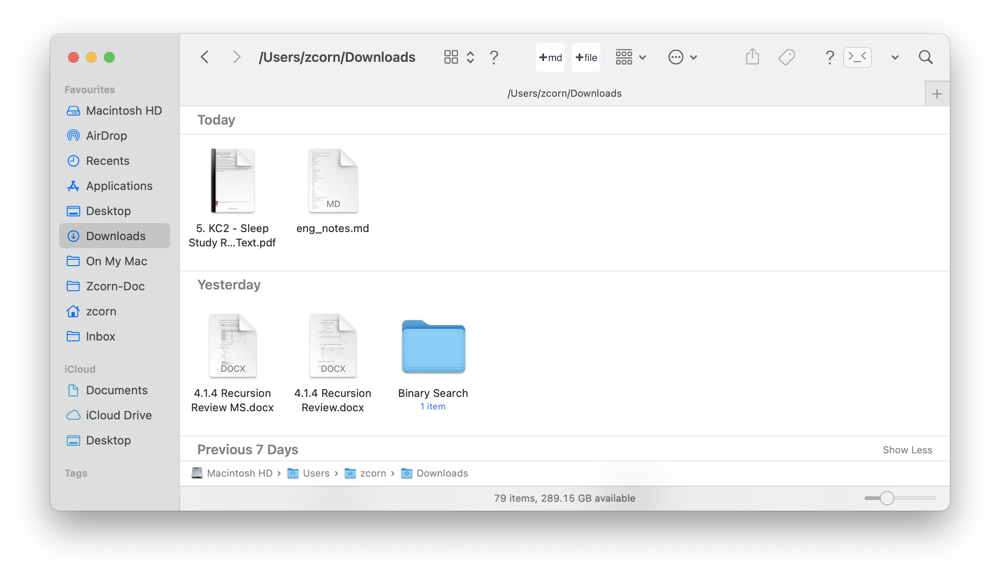

# New-File-Macos

An Mac OS Automator App to create a new file and markdown file just like the "new" option in right-click menu on Windows.

## *New Blank File*
This is to create a new file with the custom extension.

## *New Markdown File*

This is to create a new markdown file.

# How to use 
> If you encounter the `“XXX.app” can’t be opened because Apple cannot check it for malicious software.` error, pls refer to [Apple Support: Apple can’t check app for malicious software.](https://support.apple.com/en-gb/guide/mac-help/mchleab3a043/mac) for a solution.

1. Download the .zip file you need.
2. Decompress the .zip file.
3. Drag it to the "Applications" folder.
4. Go to "Finder" $\rightarrow$ "View" $\rightarrow$ "Customise Toolbar..."
5. Drag the .app file from the "Applications" folder to the preference panel of the toolbar.
6. Click the "Done" button.
7. Finally click the button to see the magic.

# What it looks like after setup

# Inspired by
[AppleScript for Creating a Text File in the Current Finder Directory](https://www.instructables.com/AppleScript-for-creating-a-text-file-in-the-curren/)
